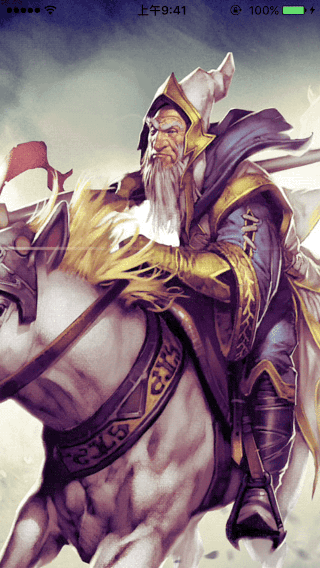
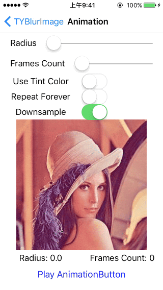
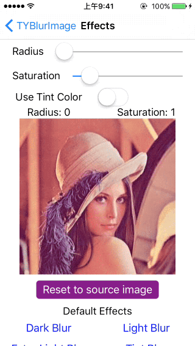

TYBlurImage
=========
[](https://travis-ci.org/luckytianyiyan/TYBlurImage)
[](http://cocoadocs.org/docsets/TYBlurImage/)
[](http://cocoadocs.org/docsets/TYBlurImage/)
[](https://www.apache.org/licenses/LICENSE-2.0.html)

An easy way to set up blur effect and play the animation.

Example
===
|               Simple               |
|:----------------------------------:|
|  |

|        UIImageView Play Blur Aniamtion        |       UIImage Blur Effects       |
|:---------------------------------------------:|:--------------------------------:|
|  |  |


Installation
===

Installation with CocoaPods
---

[CocoaPods](http://cocoapods.org/) is a dependency manager for Objective-C, which automates and simplifies the process of using 3rd-party libraries in your projects. See the [Get Started](http://cocoapods.org/#get_started) section for more details.

#### Podfile

Add the following to your Podfile.

```
pod 'TYBlurImage'
```

Usage
===

API documentation is available at [CocoaDocs - TYBlurImage](http://cocoadocs.org/docsets/TYBlurImage/)

Blur Effects
---

Just `#import` the `UIImage+BlurEffects` header.

#### Use default effects

call the following method is rapid to blur.

* ty_imageByApplyingLightEffectToImage:
* ty_imageByApplyingExtraLightEffectToImage:
* ty_imageByApplyingDarkEffectToImage:
* ty_imageByApplyingTintEffectWithColor: toImage:

```
#import <UIImage+BlurEffects.h>

...

UIImage *sourceImage = [UIImage imageNamed:@"testImage.png"];
// Light Effect
UIImage *image = [UIImage ty_imageByApplyingLightEffectToImage:sourceImage];
```

#### Use base method

- ty_imageByApplyingBlurToImage: withRadius: tintColor: saturationDeltaFactor: maskImage:

```
CGFloat blurRadius = 20.f;
CGFloat saturationDeltaFactor = 1.2f;
UIColor *tintColor = [UIColor colorWithWhite:0.4f alpha:0.3f];
UIImage *image = [UIImage ty_imageByApplyingBlurToImage:sourceImage withRadius:blurRadius tintColor:tintColor saturationDeltaFactor:saturationDeltaFactor maskImage:nil];
```

UIImageView Animation
---

Just `#import` the `UIImageView+BlurAnimation` header.

#### Quick to use

```
UIImage *sourceImage = [UIImage imageNamed:@"testImage.png"];
UIImageView *imageView = [[UIImageView alloc] initWithImage:sourceImage];
imageView.blurTintColor = [UIColor colorWithWhite:0.4f alpha:0.3f];
imageView.blurRadius = 20;
[imageView ty_blurInAnimationWithDuration:3.0f];
```
#### Using blocks

With blocks, you can be notified about whenever the image animation has completed.

```
[imageView ty_blurInAnimationWithDuration:3.0f completion:^{
	NSLog(@"complete");
}];
```

License
===

`TYBlurImage` is available under the MIT license. See the LICENSE file for more info.
